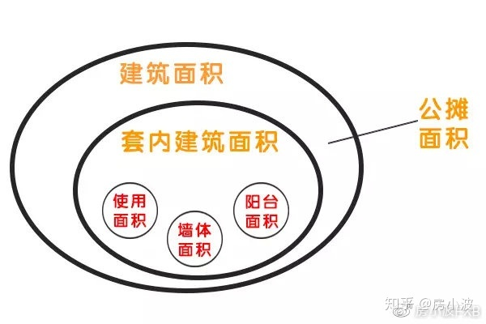

## 常用房产概念

### 新房二手房

- **新房**：现在大部分是期房，能看到的最多也就是沙盘、效果图和样板间了
  - 期房
  - 现房
- **二手房**：
  - 满二
  - 满五


### 用地性质

[用地性质](https://baike.baidu.com/item/%E7%94%A8%E5%9C%B0%E6%80%A7%E8%B4%A8/7418473)，一般情况下分为五类，包括居住用地、商业用地、工业用地、综合用地和其他用地
通过 [武汉市规划一张图](http://whonemap.zrzyhgh.wuhan.gov.cn:8020/)（或从 [武汉市自然资源和规划局](http://zrzyhgh.wuhan.gov.cn/) 页脚的**武汉市规划一张图**进入）可查看武汉各地块的规划和用途

> 如果商业用地被用来建小区别墅，是属于违建


同时小区按照开发目的可以分为几种，居民楼，单位小区，开发商新建的小区，回迁小区

- **居民楼**：上世纪六十年代，国家统一修建的小区。优点是公摊小，便宜；缺点是结构紧凑，产权复杂，居住人多
- **单位小区**：企业给员工分配的房子，一般是国企或者较大的私营企业。优点是物业环境好，建筑质量相对较好，人员结构单一，学区优秀；缺点是公告空间小，车位不足，房源紧缺。 
- **开发商新建的小区**：开发商修建的商品房小区。优点是市场主流，库存主力，房源多，房子年代比较新，配套相对比较齐全，设计理念较新进，安保比较好。缺点是捆绑装修和物业，各种附加费用较高，房屋质量一般
- **回迁小区**：大城市由政府集中修建一些小区，用来安置城市被拆迁户，这些小区一般都会承包给开发商，由开发商顺便建一些商品房来补贴利润。优点：单价便宜。缺点：质量问题严重，小区配套不齐全 ，各种奇葩问题，千万不要买回迁房


### 建筑类型

房屋的按照建筑的结构和设计，分为板楼，塔楼。板楼和塔楼各有自己的特点，现在开发商大多采用这二种建筑结构和设计

- [板楼](https://baike.baidu.com/item/板楼/10988345)：一般建筑层数不会超过*12层*
  - 优点：户型规矩，通风日照好  
  - 缺点：房价高，格局不宜改造
- [塔楼](https://baike.baidu.com/item/塔楼/1874)：一般层数较多，同一楼层的住户多为*6户*以上
  - 优点：筑密度较高，房价较低，空间结构灵活，易于改造，结构强度高
  - 缺点：居住密度高，容易出现暗厨暗卫(采光差)


### 房屋类型

- **商品房**：普通商品房的房屋产权属于个人所有，房屋土地性质为国有或出让，只要不被当地的限购政策限制，就可以购买。是刚需购房者优先考虑的目标
- **公寓**：一种商业或地产投资中的居住形式，也是商品房其中的一种，属于商办性质，**产权通常只有40年或50年**


### 房屋面积

> 详情：[知乎](https://zhuanlan.zhihu.com/p/99692311)



#### 建筑面积

```tex
建筑面积 = 套内建筑面积 + 公摊面积
```

建筑面积指建筑物外墙外围所围成空间的水平面积

#### 套内面积

套内面积（全名套内建筑面积）由套内使用面积、套内墙体面积、阳台建筑面积三部分组成

#### 公摊面积

公用分摊建筑面积是指每套(单元)商品房依法应当分摊的公用建筑面积，分摊的公用建筑面积为本幢内的业主所共有且要满足只为本幢服务
包括：电梯井，管道井，楼梯间，垃圾道，变电室，设备间、公共门厅、过道、地下室、值班警卫室等。不同的楼栋，公摊面积也是不同的


### 得房率

```tex
得房率 = 套内建筑面积 / 套型建筑面积
套内建筑面积 = 套内使用面积 + 套内墙体面积 + 阳台面积
套型建筑面积 = 套内建筑面积 + 分摊的公用建筑面积(俗说公摊面积)
```

得房率是指可供住户支配的面积与每户建筑面积之比。一般多层的建筑物得房率为88%，高层的建筑物得房率为72%，而办公楼为55%。
得房率太低或者太高都不好，太高可能小区比较小，楼栋间距比较小，会比较压抑，采光也会有影响；太低的话就有点不实惠，买的都是公摊面积


### 公摊率

```tex
公摊率 = 总公摊面积 / 总建筑面积
```

房屋公摊率是指房屋公摊面积占房屋总面积的比率。对于公摊面积的处理，目前我国尚无明确法律法规出台，因公摊面积的不明确，使其成为房地产交易过程中争论的焦点。公摊率主要用于计算在住宅小区之中公用建筑设施（配电房、楼道、电梯井、公用通道、消防设施以及其他公用设施）在小区总建筑面积之中所占比例


